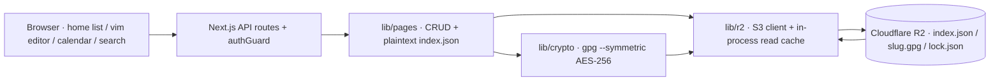

# Fanaa

> A private, vim-operated journal that encrypts every page locally with gpg AES-256 before it ever reaches Cloudflare R2.


---

## Why this project exists

Public cloud storage is convenient, but a journal's words should only exist in plaintext for the person who wrote them. Fanaa turns any browser into a terminal where every entry is encrypted on the server with `gpg --symmetric AES-256` before a single byte is written to an S3-compatible bucket. The engineering is interesting because the encryption runs on ephemeral, read-only-filesystem hosts — gpg is spawned as a subprocess with a scratch home directory — while listing, stats, and streaks work off a small plaintext index that never contains the actual words.

## What it does

- **True vim over the wire** — real vim keybindings (registers, visual modes, macros) via CodeMirror + `@replit/codemirror-vim`, plus working ex commands `:w`, `:q`, `:wq`, `:q!` (`src/components/VimEditor.tsx:227`).
- **Encrypted before it means anything to anyone else** — every save runs `gpg --symmetric --cipher-algo AES256` on the server, so the bucket only ever holds ciphertext (`src/lib/crypto.ts:81`).
- **Autosave that is hard to lose to** — changes are written ~0.9s after the last keystroke (`src/components/VimEditor.tsx:31`), again on tab-hide/unload (`:270`), and failed saves retry every 3 seconds (`:141`).
- **A journal that locks like a phone** — optional salted-scrypt PIN (4–64 chars enforced at `src/lib/lock.ts:19`), verified server-side in constant time (`src/lib/lock.ts:87`); 5 wrong tries lock the endpoint for 15s (`src/app/api/lock/verify/route.ts:10`).
- **Optional session gate** — setting `APP_HASH_KEY` turns on a full-app key prompt backed by an httpOnly HMAC session cookie (`src/lib/auth.ts:48`) with the same 5-tries / 15s throttle (`src/app/api/auth/login/route.ts:15`).
- **grep your whole journal** — full-text search decrypts every entry four at a time (`src/lib/pages.ts:252`) and returns a snippet around the first match, falling back to the first line for title-only hits (`src/lib/pages.ts:289`).
- **A Unix calendar** — `cal`-style month grid navigated with h/j/k/l that opens a day's entry or creates a new one dated for the selected day (`src/components/Calendar.tsx:32`).
- **Streaks and totals without reading your words** — word counts and streak (checked from today, forgiving a paused yesterday) come from the plaintext index, never from decrypted content (`src/lib/pages.ts:214`, `src/lib/stats.ts:72`).
- **One-click plaintext backup** — every page exports as a `.zip` of `.md` files plus an index, with a README inside warning the archive is unencrypted and should be stored somewhere private (`src/lib/export.ts:39`).
- **Bounds enforced in both directions** — titles are clipped to 80 chars (`src/lib/title.ts:12`), slugs must match exactly 8 hex chars (`src/lib/pages.ts:48`), dates must be `YYYY-MM-DD` (`src/lib/pages.ts:70`), line-heights are a fixed preset list, and the home list pages at 17 rows so the footer never scrolls off (`src/components/HomeMain.tsx:28`).
- **Degrades to a setup screen** — with R2 vars missing the app renders a terminal dialog listing exactly what to add to `.env` instead of crashing (`src/app/(app)/page.tsx:42`).

## Architecture



Press Enter on an entry in the home list and the browser hits `GET /api/pages/:slug`, which fetches that page's `<slug>.gpg` through the R2 read cache, spawns gpg to decrypt it with `ENC_PASSPHRASE`, merges in the title/date/line-height from the plaintext index, and returns fully decrypted markdown. The Vim editor mounts from that payload; after ~0.9s of quiet typing it `PUT`s the buffer back, the server re-encrypts and writes the blob through the cache, and the index is updated inside a serialized lock so the home screen's title/stats stay current.

## Key technical decisions

### 1. Encryption through a gpg subprocess (security / deploy gotcha)

Encryption is a spawned `gpg` binary, not a JS crypto library, and the invocation is shaped to survive serverless filesystems.

**Problem:** `gpg` needs a writable home directory even for symmetric ops, but on hosts like Vercel `$HOME` can point nowhere and only `/tmp` is writable, so a stock call dies with `can't create directory '$HOME/.gnupg'` (`src/lib/crypto.ts:18`). Passing the passphrase as an argv flag would also leak it into the process list.

**Solution:** a scratch gnupg home is created under the OS temp dir for every invocation and thrown away (`src/lib/crypto.ts:25`), and the passphrase is fed on file descriptor 3 via `--passphrase-fd 3` so it never appears in argv or stdin (`src/lib/crypto.ts:44`).

**Outcome:** the same code path works on local dev, Render, and Vercel alike, and the secret never shows up in `ps` output.

### 2. A plaintext index beside encrypted blobs (two-tier state)

The bucket holds ciphertext `.gpg` files plus one small plaintext `index.json` carrying titles, `updatedAt`, optional dates, and word counts (`src/lib/pages.ts:40`).

**Problem:** rendering the home screen used to require decrypting every file — N gpg spawns and N R2 round trips just to show a list.

**Solution:** `listPages`, `totalWords`, and streak math read only the single index object, and decryption happens lazily per page (`src/lib/pages.ts:214`); writes push the encrypted blob first, then update the index.

**Outcome:** the home page renders from one R2 GET, and the simplest possible object is the only plaintext copy of anything.

### 3. Serialized read-modify-write on the index (correctness)

Concurrent saves from two tabs can interleave on `index.json` and silently drop a title, date, or word-count update.

**Problem:** R2 offers no compare-and-swap, so a naive read → mutate → write from two in-flight requests corrupts metadata at journal scale (`src/lib/pages.ts:92`).

**Solution:** every index mutation is chained onto a module-level promise queue through `withIndexLock`, so index writes run strictly one at a time while content blobs still write independently and the queue survives rejected mutations (`src/lib/pages.ts:99`).

**Outcome:** tab A and tab B editing different pages never lose each other's metadata.

### 4. Bounded parallel decryption (throttling)

Search and export must read every page, but doing it serially is slow and doing it without a cap spawns a gpg process storm.

**Problem:** N entries meant N serial R2 round trips plus N gpg spawns, and naive `Promise.all` would fire dozens of subprocesses at once (`src/lib/pages.ts:249`).

**Solution:** `mapLimit` runs at most 4 decrypt jobs concurrently while preserving result order, and both full-text search and zip export route through the same helper (`src/lib/pages.ts:229`, `src/lib/export.ts:25`).

**Outcome:** a large journal decrypts in roughly a quarter of the serial wall time with a flat, predictable sidecar process count.

### 5. The client is hostile (security)

Every API route re-validates what the UI already did, because a browser's calls are not an API contract — and both the PIN and the hash key get server-side brute-force throttles.

**Problem:** content, slugs, dates, and line-heights arrive as untyped JSON; if only the client validated them, a crafted request could write junk keys or probe protected data.

**Solution:** content is type-checked (`src/app/api/pages/[slug]/route.ts:44`), slugs must match `^[a-f0-9]{8}$` (`src/lib/pages.ts:48`), dates must be `YYYY-MM-DD` (`src/lib/pages.ts:70`), line-heights must be one of five presets (`src/lib/line-height.ts:19`), and the optional session gate is enforced by `authGuard()` at the top of every data route rather than by hiding UI (`src/lib/auth.ts:88`); wrong PIN and wrong key both trip a 15s lockout after 5 attempts.

**Outcome:** a hand-crafted request gets a 400 or 401 and can neither create, read, modify, nor delete anything it shouldn't.

### 6. Version baked at build time, three fallbacks deep (deploy gotcha)

The version label next to the logo is resolved when the code compiles, not when it runs.

**Problem:** Render and Docker build images ship without `.git` or tags, where `git describe` fails; a naive `--always` flag silently exited 0 with a bare commit SHA, which would have surfaced as the UI version (`next.config.ts:17`).

**Solution:** an explicit `NEXT_PUBLIC_APP_VERSION` wins first, then the nearest git tag, then `package.json` version, then `dev` — with `--always` deliberately omitted so a tag-less repo fails loudly and falls through (`next.config.ts:23`).

**Outcome:** the label is constant per build, and a build environment with no git history still shows a sane `v1.2.2`-style version.

## Run locally

Requirements: **Node 20+** and a **gpg 2.x binary on PATH** (gpg is spawned for every encrypt/decrypt — `src/lib/crypto.ts:37`).

```bash
npm install
cp .env.example .env        # then fill in R2_* + ENC_PASSPHRASE
npm run dev                 # http://localhost:3000
```

No R2 account yet? Run against the bundled in-memory S3 mock — zero config:

```bash
node scripts/mock-r2.mjs &  # in-memory S3 server on :9099
R2_ENDPOINT=http://127.0.0.1:9099 R2_ACCOUNT_ID=local R2_ACCESS_KEY_ID=test \
R2_SECRET_ACCESS_KEY=test R2_BUCKET_NAME=test-bucket ENC_PASSPHRASE=whatever npm run dev
```

Production build and start:

```bash
npm run build && npm start
```

Lint: `npm run lint`.

## Configuration

| Env var | Required | Effects when set |
| --- | --- | --- |
| `R2_ACCOUNT_ID` | ✅ | The S3 endpoint is built from it (`https://<id>.r2.cloudflarestorage.com`). Unset → the app prints the storage-not-configured screen (`src/lib/r2.ts:71`) |
| `R2_ACCESS_KEY_ID` | ✅ | S3 credential for the bucket. Unset → storage not configured |
| `R2_SECRET_ACCESS_KEY` | ✅ | S3 credential for the bucket. Unset → storage not configured |
| `R2_BUCKET_NAME` | ✅ | Bucket holding `index.json`, `<slug>.gpg`, and `lock.json`. Unset → storage not configured |
| `ENC_PASSPHRASE` | ✅ | Secret for every gpg AES-256 encrypt/decrypt. Unset → storage not configured; a wrong passphrase shows a clear "could not decrypt this page" screen (`src/app/(app)/pages/[slug]/page.tsx:24`) |
| `R2_FOLDER` | — | Prefixes all objects with `<folder>/`. Unset → objects live at the bucket root (`src/lib/r2.ts:96`) |
| `APP_HASH_KEY` | — | Enables the per-session hash-key gate and signed httpOnly cookie. Unset → the gate is disabled and the app opens directly (`src/lib/auth.ts:16`) |
| `R2_ENDPOINT` | — | Points the S3 client at a local mock instead of real R2 and forces path-style requests. Unset → real Cloudflare endpoint (`src/lib/r2.ts:104`) |
| `NEXT_PUBLIC_APP_VERSION` | — | Pins the version label shown next to the logo. Unset → resolved at build time as env → git tag → package.json version → `dev` (`next.config.ts:14`) |

## Project structure

```
fanaa/
├─ src/app/           # Routes — home, search, pages/[slug], and the /api/* handlers
├─ src/components/    # Terminal UI — vim editor, lock screens, home list, calendar
├─ src/lib/           # Core — pages CRUD, gpg crypto, R2 client, auth, lock, stats
├─ scripts/           # mock-r2.mjs — in-memory S3 server for local testing
├─ next.config.ts     # Security headers + version baked in at build time
├─ .env.example       # Documented template for every env var the app reads
└─ package.json       # Next 16 + React 19; dev / build / start / lint scripts
```

---

Write it, lock it, vanish — the words stay yours even when they leave your hands.

---

<div align="left">
  <font face="Aref Ruqaa" size="5">فیروز خان چوہان</font>
</div>