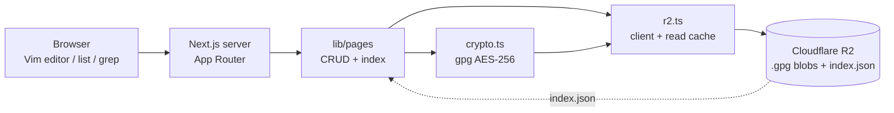

# Fanaa

> A private journal that behaves like a terminal.


---

## Why this project exists

Cloud journals are only as private as the vendor that stores them. Fanaa encrypts every entry before it ever leaves the server and dresses the whole journal as a terminal — vim keys, grep, `cal`, a shell prompt — so privacy lives in the storage layer, not in trust of anyone else.

## What it does

- **Vim everywhere** — the journal is a real vim buffer; `:w`, `:q`, `:q!` work, and autosave fires 0.9s after the last keystroke, so a lost entry is nearly impossible. `src/components/VimEditor.tsx:31`
- **Encrypted at rest** — each entry is AES-256 gpg-encrypted server-side before upload; only metadata is plaintext. `src/lib/crypto.ts:82`
- **Full-text grep** — `/` searches every entry, decrypting on the fly, and returns a snippet around each match. `src/lib/pages.ts:259`
- **Calendar view** — `c` opens a `cal`-style month grid navigable with vim keys; `n` writes an entry for any selected day. `src/components/Calendar.tsx:39`
- **PIN + auto-lock** — an scrypt-hashed PIN (4–64 chars) gates the app; it re-locks after inactivity (default 5 min) or on tab switch. `src/lib/lock.ts:19` `src/lib/lock-client.ts:20`
- **Optional session gate** — setting `APP_HASH_KEY` puts a login screen on every open, enforced server-side, not just by hiding UI. `src/lib/auth.ts:88`
- **One-click backup** — downloads a zip of every entry as readable markdown plus an index; plaintext on purpose, so guard it. `src/lib/export.ts:17`
- **Journal stats** — entries, total words, streak, and today's count, computed from the index without decrypting anything. `src/app/(app)/page.tsx:16`

## Architecture



Saving a page runs Vim buffer → `PUT /api/pages/[slug]` → `updatePage` → gpg encrypt → R2; the home list renders straight from the plaintext `index.json`, so browsing and stats never decrypt a single entry.

## Key technical decisions

### 1. Two-tier state: plaintext index, encrypted blobs (metadata)

**Problem:** Rendering the list, search, and stats meant decrypting every entry.
**Solution:** `index.json` holds only titles/dates/word counts; `<slug>.gpg` holds content. `src/lib/pages.ts:42`
**Outcome:** Browsing and stats are decryption-free; content is touched only when a page opens.

### 2. gpg as a subprocess with a scratch homedir (deploy)

**Problem:** AES-256 must work on serverless hosts where `$HOME` doesn't exist and the filesystem is read-only except `/tmp`.
**Solution:** Spawn `gpg --symmetric` with a scratch homedir under `/tmp`; the passphrase travels on fd 3, never argv or stdin. `src/lib/crypto.ts:26`
**Outcome:** The same code path runs on local, Render, and Vercel; the key never leaks into process arguments.

### 3. Treating the client as hostile (security)

**Problem:** UI-only locks are cosmetic; every data route must self-enforce.
**Solution:** `authGuard()` runs first in every data route; constant-time compares, an HMAC-signed cookie, and 5-fail/15s brute-force throttles. `src/lib/auth.ts:88`
**Outcome:** A forged cookie or hammered PIN/key cannot read data.

### 4. Process-local read cache on `globalThis` (latency)

**Problem:** Every action re-reads the same small objects; each R2 round-trip costs 100–300ms and duplicate serial reads dominated latency.
**Solution:** A TTL-bounded (5s), byte-capped (8MB) cache lives on `globalThis` — shared across Turbopack's per-segment module copies — and writes through on save/delete. `src/lib/r2.ts:39`
**Outcome:** Serial duplicate reads collapse; staleness across instances is bounded to one TTL.

### 5. Serialized index writes (correctness)

**Problem:** Concurrent saves from two tabs could interleave read-modify-write cycles and drop a title/date/word update.
**Solution:** A promise-queue lock serializes every mutation of `index.json`; content blobs stay independent. `src/lib/pages.ts:99`
**Outcome:** No lost metadata updates under concurrency.

## Run locally

Requires Node 20.9+ (Next.js 16 engine) and the `gpg` binary.

```bash
cp .env.example .env   # fill in R2_* and ENC_PASSPHRASE
npm install
npm run dev
```

Production: `npm run build && npm start`. Lint: `npm run lint`.

No R2 credentials yet? The app still boots — it shows a "storage not configured" screen (`src/app/(app)/page.tsx:42`). For offline dev, point `R2_ENDPOINT` at the in-memory mock instead: `node scripts/mock-r2.mjs`.

## Configuration

| Env var | Required | Effects when set |
|---|---|---|
| `R2_ACCOUNT_ID` | ✅ | R2 endpoint host; unset → storage not configured. |
| `R2_ACCESS_KEY_ID` | ✅ | S3 credentials for R2. |
| `R2_SECRET_ACCESS_KEY` | ✅ | S3 credentials for R2. |
| `R2_BUCKET_NAME` | ✅ | Bucket all objects live in. |
| `ENC_PASSPHRASE` | ✅ | AES-256 key for every page; unset → gpg calls throw. |
| `R2_FOLDER` | — | Prefixes all objects under `<folder>/`; unset = bucket root. |
| `R2_ENDPOINT` | — | Switches to a local S3-compatible mock; unset = `*.r2.cloudflarestorage.com`. |
| `APP_HASH_KEY` | — | Enables the session gate; unset = gate skipped. |
| `NEXT_PUBLIC_APP_VERSION` | — | Pins the version label; unset = git tag → package.json → "dev". |

## Project structure

```
Fanaa/
├─ src/app/(app)/                # home, editor, search pages
├─ src/app/api/                  # auth / lock / pages / export routes
├─ src/app/layout.tsx            # root gate: session → lock → app
├─ src/lib/pages.ts              # index + page CRUD, search
├─ src/lib/r2.ts                 # R2 client + read cache
├─ src/lib/crypto.ts             # gpg AES-256 encrypt/decrypt
├─ src/lib/auth.ts               # hash-key session gate
├─ src/lib/lock.ts               # scrypt PIN store
├─ src/components/VimEditor.tsx  # CodeMirror + vim buffer
└─ scripts/mock-r2.mjs           # local S3-compatible mock
```

---
Keep writing — every word here disappears into the dark.
---

<div align="left">
  <font face="Aref Ruqaa" size="5">فیروز خان چوہان</font>
</div>
